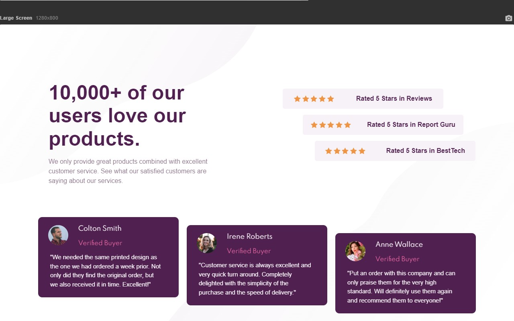
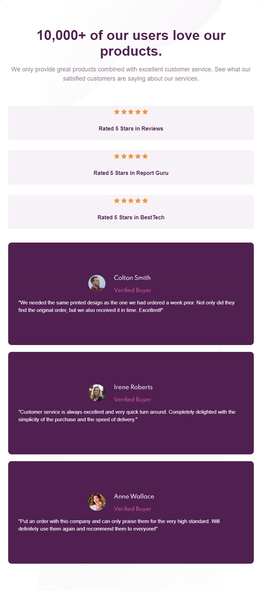
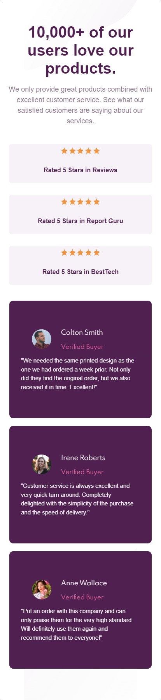

# Frontend Mentor - Social proof section

Esta é uma solução para o [Social proof section](https://www.frontendmentor.io/challenges/social-proof-section-6e0qTv_bA). Os desafios do Frontend Mentor ajudam você a melhorar suas habilidades de codificação ao construir projetos realistas.

## Resumo de conteúdos

- [Visão Geral](#Visão-Geral)
  - [O desafio](#O-desafio)
  - [Captura de tela](#Captura-de-tela)
  - [Links](#Links)
- [Meu processo](#Meu-processo)
  - [Construído com](#Constrído-com)
  - [O que eu aprendi](#O-que-eu-aprendi)
  - [Continuação dos desenvolvimentos](#Continuação-dos-desenvolvimentos)
  - [Recursos utilizados](#Recursos-utilizados)
- [Autor](#Autor)

## Visão Geral.

### O desafio

Os usuários devem ser capazes de:

- Veja estados de foco para elementos interativos.
- dois efeitos de fundo integrados.
- Criação de um cartão de informações.
- Observar um design responsivo.
- Divisão dos elementos na tela com display grid.

### Captura de tela

- Desktop
<p  align="center" >

</p>

- Tablet
<p  align="center" >
  
</p>

- Mobile
<p  align="center" >
  
</p>

- Gif
<p  align="center" >
  
</p>

### Links

- Solução URL: [https://github.com/michelwene/social-proof-section-master](https://github.com/michelwene/social-proof-section-master)
- Live Site URL: [https://michelwene.github.io/nft-preview-card-component/](https://michelwene.github.io/stats-preview-card/)

## Meu processo

### Construído com

- HTML5
- CSS3
- Flexbox
- Grid
- Design responsivo
- EMMET

### O que eu aprendi

```html
<h1>Algum código HTML de que me orgulho</h1>
<div class="avaliacao">
          <div class="avaliacao__principal">
            <span class="avaliacao__estrela"></span>
            <p class="avaliacao__descricao">Rated 5 Stars in Reviews</p>
          </div>
          <div class="avaliacao__principal">
            <span class="avaliacao__estrela"></span>
            <p class="avaliacao__descricao">Rated 5 Stars in Report Guru</p>
          </div>
          <div class="avaliacao__principal">
            <span class="avaliacao__estrela"></span>
            <p class="avaliacao__descricao">Rated 5 Stars in BestTech</p>
          </div>
        </div>

        <!--Esta parte foi a parte da avaliação onde contém as estrelas na página, como pode ser percebido a nomenclatura das classes estão perfeitamente e bem separados, o que facilita muito quando chega a parte da estilização, pois eu consegui compreender exatamente onde deveria mexer. -->
```

```css
.Orgulho-deste-css {
.thumbnail {
  position: relative;
  float: left;
  width: 50%;
}

:root {
  --cor-magenta: hsl(300, 43%, 22%);
  --cor-rosa: hsl(333, 80%, 67%);
  --cor-magenta-cinzento: hsl(303, 10%, 53%);
  --cor-magenta-cinzento-clara: hsl(300, 24%, 96%);
}

/* Neste css foi a primeira vez que fiz uso das variaveis, o que facilita muito na hora da estilização pois não preciso ir ficar copiando e colando a cor a todo momento, eu apenos declaro a variavel no elemento e pronto, consigo resgatar a mesma cor.*/ 


.app {
  background-image: url(../img/bg-pattern-top-desktop.svg);
  background-repeat: no-repeat;
  background-size: 50%;
  display: grid;
  font-family: Arial, Helvetica, sans-serif;
  grid-template-areas: "conteudo";
  grid-template-columns: auto;
  grid-template-rows: auto;
}

.conteudo {
  background-image: url(../img/bg-pattern-bottom-desktop.svg);
  background-repeat: no-repeat;
  background-position: bottom right;
  background-size: 70%;
  grid-area: conteudo;
  padding: 0 2rem;
}
/* No css acima eu deveria integrar dois backgrounds, um ficaria na parte de baixo e o outro ficaria na parte de cima, qual solução para o problema eu encontrei? Declarei um background para o body "app" e outro para o main "conteudo", os dois se integraram de primeira. E também fiz a mesma coisa no mobile.*/
}


```

### Continuação dos desenvolvimentos

Pretendo continuar fazendo projetos do FrontendMentor, para melhorar meu HTML, CSS, JavaScript.

### Recursos utilizados

- [CSS tricks](https://css-tricks.com/snippets/css/complete-guide-grid/) - Como o Grid era uma novidade para mim, este site me auxiliou na hora de aplicar o CSS Grid no projeto.

## Autor

- Frontend Mentor - [@michelwene](https://www.frontendmentor.io/profile/michelwene)
- Linkedin - [@michelwene](https://www.linkedin.com/in/michelwene/)
